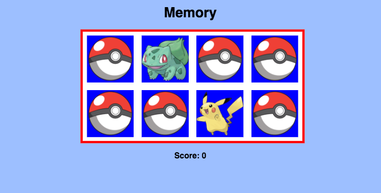

# Memory

A Pokemon-themed concentration game built using [AngularJS](https://angularjs.org/). Find all the pairs of matching Pokemon!

Scoring: Players get one point for each correct guess and lose a point for each incorrect guess.

This project is generated with [yo angular generator](https://github.com/yeoman/generator-angular)
version 0.11.1.

## Build & development

Run `grunt` for building and `grunt serve` for preview.
